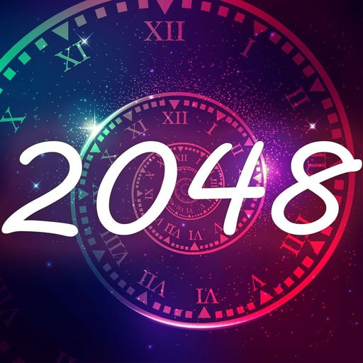
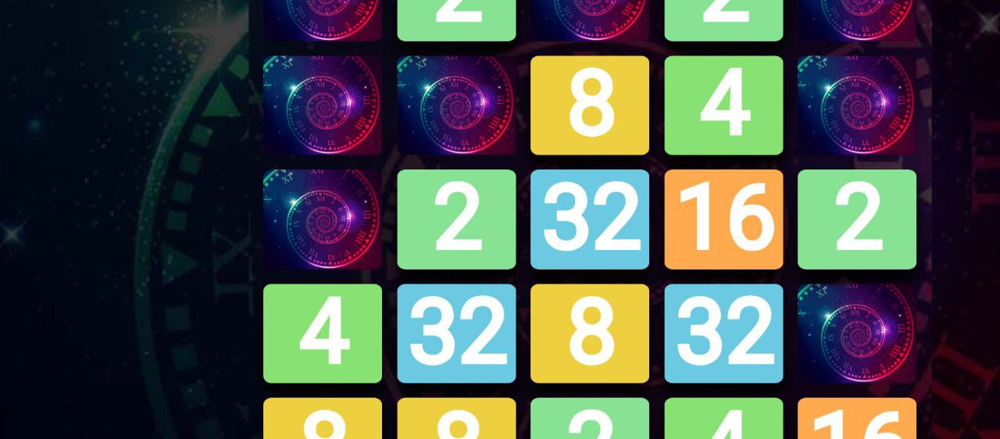
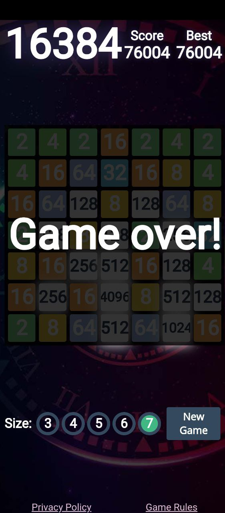
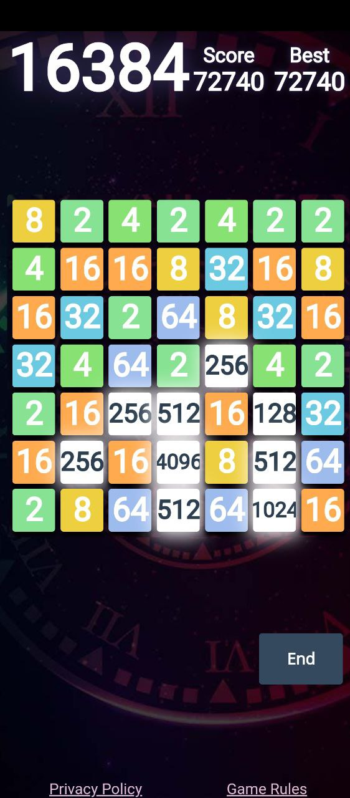
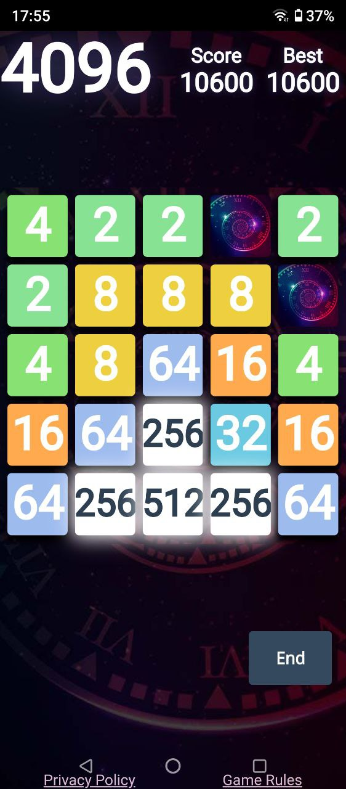
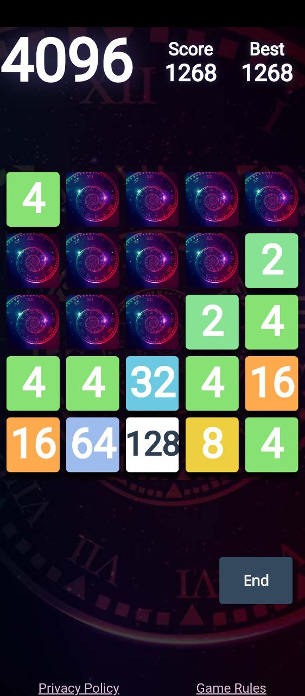
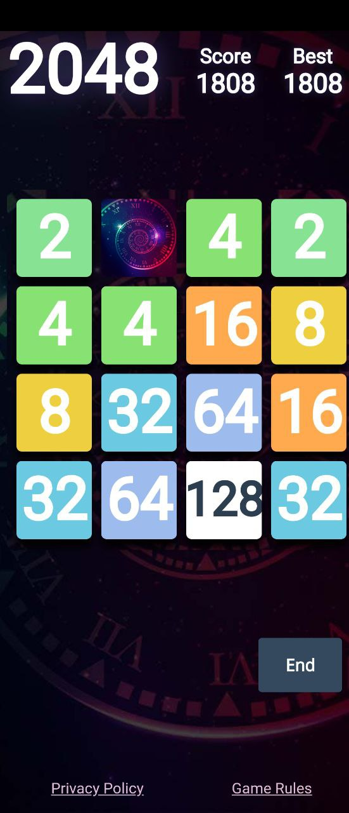

# 2048 Puzzle Merge Numbers Game

2048 Merge Puzzle
==================

[2048 Puzzle Website](https://2048-puzzle.online/ "2048 Puzzle Website")
[Play 2048 Puzzle](https://play.google.com/store/apps/details?id=site.z3w.numberPuzzle)

In the dynamic world of mobile gaming, where innovation constantly pushes the boundaries of entertainment, one puzzle game has captured the hearts and minds of players worldwide – the _2048 Puzzle Game_. This digital brain teaser, known for its simplicity and strategic depth, has become a sensation, captivating users with its addictive gameplay and challenging mechanics.

Unraveling the 2048 Puzzle Game Phenomenon: A Journey into Strategic Entertainment
----------------------------------------------------------------------------------

### The Birth of 2048

The **2048 Puzzle Game** was created by Gabriele Cirulli in 2014. Born out of a desire to experiment with game development, Cirulli unleashed a game that would soon become a global phenomenon. The game's premise is straightforward: players slide numbered tiles on a grid, combining identical numbers to create a tile with a higher value, ultimately aiming to reach the elusive tile labeled "2048."

### Gameplay Mechanics

At first glance, 2048 appears deceptively simple. The game features a 4x4 grid where players slide tiles in four directions – up, down, left, or right. When two tiles with the same number collide, they merge into one, doubling the value. The challenge lies in strategically combining tiles to reach the coveted 2048 tile while the grid fills up with new tiles after each move.

### Addictive Nature

The beauty of 2048 lies in its addictive nature. The game offers a perfect blend of simplicity and complexity, making it accessible to players of all ages. The rules are easy to grasp, yet achieving the 2048 tile requires forethought, strategy, and a bit of luck. The addictive loop of merging tiles to create higher values keeps players engaged for hours on end, fueling a sense of accomplishment with each milestone reached.

### Strategic Depth

Beyond its surface simplicity, 2048 conceals a strategic depth that appeals to puzzle enthusiasts. Players quickly learn that success hinges on planning several moves ahead, considering the consequences of each swipe. The game requires a delicate balance of short-term tactics and long-term strategy, fostering a sense of mental engagement that keeps players coming back for more.

### Endless Variations

One of 2048's enduring charms is its adaptability. The game's open-source nature has led to countless variations and adaptations. Developers and enthusiasts have created themed versions, introducing unique twists to the gameplay. Whether it's replacing numbers with letters, using colors, or incorporating images, the 2048 concept has proven to be a versatile canvas for creative expression.

### Community and Competitions

2048 has fostered a vibrant online community of players sharing strategies, tips, and their highest scores. The competitive spirit has led to friendly rivalries, with players challenging each other to reach higher tile values. The pursuit of leaderboard supremacy has turned 2048 into a social experience, connecting players from around the globe.

### Conclusion

In the realm of mobile gaming, the 2048 Puzzle Game stands as a testament to the enduring appeal of well-crafted, intellectually stimulating experiences. Its elegant design, strategic depth, and addictive gameplay have secured its place as a classic in the ever-evolving landscape of digital entertainment. Whether you're a casual player seeking a quick mental challenge or a dedicated strategist aiming for the elusive 2048 tile, this puzzle game continues to provide an engaging and rewarding experience for players of all backgrounds.

#### 
